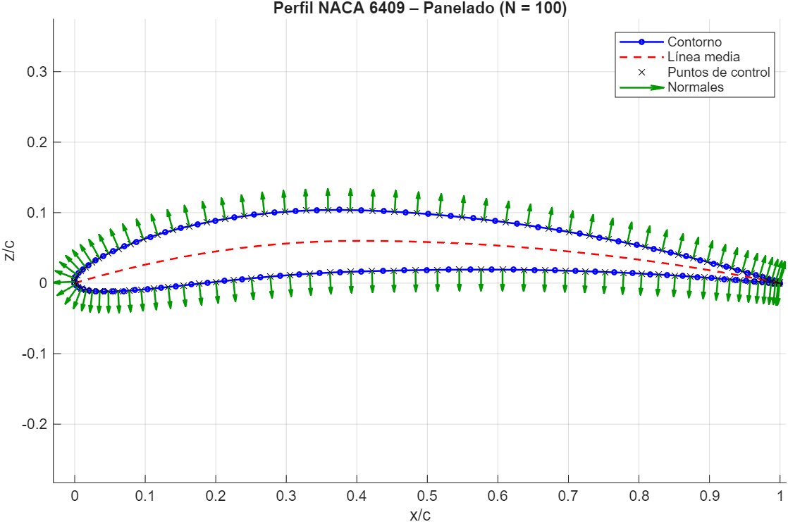
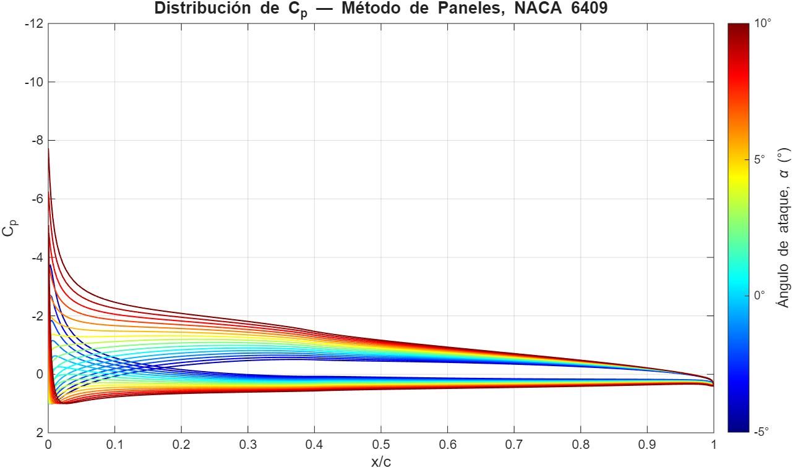
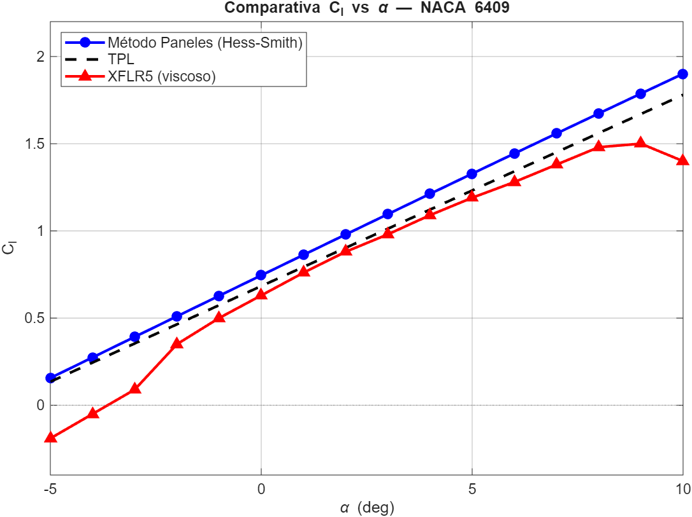
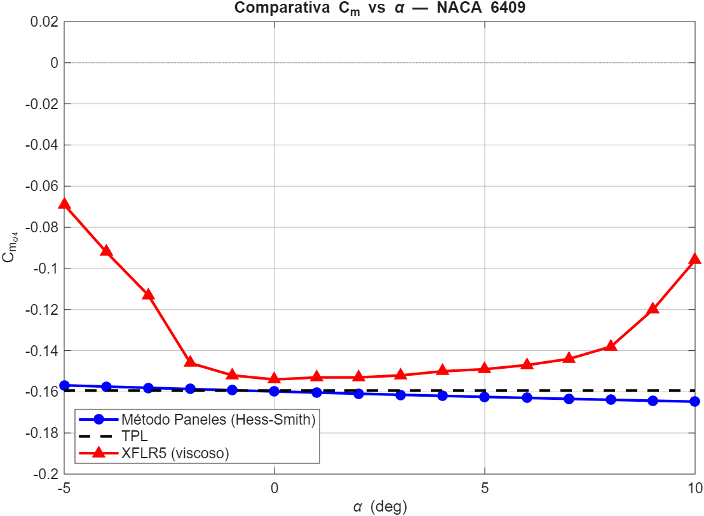

# Método de Paneles — NACA 6409


Implementación en **MATLAB** de un método de paneles para el análisis aerodinámico bidimensional del perfil **NACA 6409**.


El proyecto desarrolla un modelo de flujo potencial basado en una distribución de **fuentes y vorticidad**, aplicando las condiciones de no penetración y de Kutta. Los resultados se comparan con la **Teoría Potencial Linealizada (TPL)** y con resultados obtenidos mediante **XFLR5**.


## Metodología


El análisis se estructura en cuatro etapas:


### 1. Generación de la geometría

- Construcción del perfil NACA 6409.

- Discretización mediante distribución cosenoidal de nodos.

- Cálculo de puntos de control y vectores normales.


### 2. Método de paneles

- Cálculo de las matrices de influencia de fuentes y vórtices.

- Imposición de la condición de no penetración.

- Aplicación de la condición de Kutta.

- Resolución del sistema para obtener las intensidades de las singularidades.


### 3. Cálculo aerodinámico

- Distribución del coeficiente de presión, `Cp`.

- Coeficiente de sustentación, `Cl`.

- Coeficiente de momento respecto a `c/4`, `Cm`.


### 4. Validación y comparación

- Comparación con la Teoría Potencial Linealizada.

- Comparación con resultados obtenidos mediante XFLR5.

- Análisis de la influencia de la discretización.


## Resultados

### Geometría y discretización

El perfil NACA 6409 se discretiza mediante una distribución cosenoidal de nodos, aumentando la resolución en las proximidades de los bordes de ataque y salida.



### Distribución de presión

Distribución del coeficiente de presión sobre extradós e intradós para ángulos de ataque comprendidos entre -5° y 10°.



### Comparación de resultados

Los coeficientes aerodinámicos obtenidos mediante el método de paneles se comparan con la Teoría Potencial Linealizada y con resultados obtenidos mediante XFLR5.

#### Coeficiente de sustentación



#### Coeficiente de momento




## Ejecución

Los scripts pueden ejecutarse directamente desde MATLAB:

- `generar_geometria.m`: genera la geometría y el panelado del perfil.
- `resolver_metodo_paneles.m`: resuelve el método de paneles Hess–Smith.
- `teoria_potencial_linealizada.m`: calcula los coeficientes mediante TPL.
- `calcular_distribucion_presion.m`: obtiene la distribución de `Cp` para distintos ángulos de ataque.
- `comparar_metodos.m`: compara los resultados de Paneles, TPL y XFLR5.


## Documentación

La memoria técnica completa del proyecto, incluyendo el desarrollo teórico, la implementación del método de paneles y el análisis de resultados, está disponible en:

📄 [Memoria técnica — Método de Paneles NACA 6409](docs/Memoria_Tecnica_NACA_6409.pdf)


## Estructura del repositorio


```text
NACA-Panel-Method/
│
├── src/
│   ├── generar_geometria.m
│   ├── resolver_metodo_paneles.m
│   ├── teoria_potencial_linealizada.m
│   ├── calcular_distribucion_presion.m
│   └── comparar_metodos.m
│
├── resultados/
│   ├── geometria_panelado.png
│   ├── distribucion_presion.png
│   ├── comparacion_cl.png
│   └── comparacion_cm.png
│
├── docs/
│   └── Memoria_Tecnica_NACA_6409.pdf
│
├── .gitignore
└── README.md
```


## Tecnologías y métodos


**MATLAB** · **XFLR5** · Método de paneles · Teoría Potencial Linealizada · Métodos numéricos · Aerodinámica potencial


## Autoría


Proyecto académico desarrollado en equipo en el Grado en Ingeniería Aeroespacial. Implementación y análisis numérico realizados en MATLAB.


**Sandra Castresana Sánchez**

